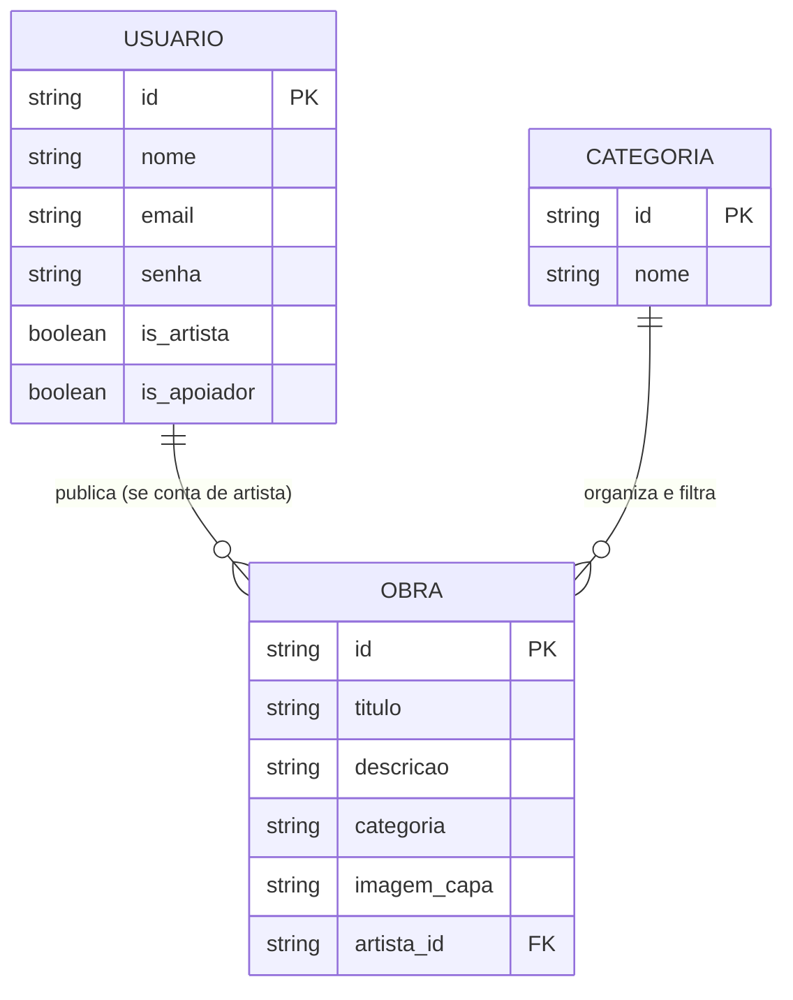

# 🏗️ 1. Especificações Técnicas (Tech Spec) - Projeto Latina

Este documento descreve a arquitetura técnica, o modelo de dados em formato JSON e as tecnologias que serão utilizadas no desenvolvimento da plataforma **Latina**.

---

## 1. Modelo de Dados (Diagrama ER)

 O diagrama abaixo representa a estrutura lógica dos objetos que serão manipulados via **arquivos JSON** e armazenados localmente (ex: Local Storage) para simular o funcionamento do sistema.

2. Dicionário de Dados
   Breve explicação do funcionamento do sistema.
    
### 👤 Coleção: `usuarios.json`
Responsável por armazenar os dados de todos os visitantes que se cadastram na plataforma, sejam eles usuários padrão, artistas ou apoiadores.

- **`id`**: Identificador único do usuário (Gerado automaticamente).
- **`nome`**: Nome completo do usuário.
- **`email`**: E-mail para login e contato (Deve ser único).
- **`senha`**: Senha de acesso (Mínimo de 8 caracteres).
- **`is_artista`**: Campo booleano (`true`/`false`) que define se o usuário marcou a opção "Conta de Artista" no cadastro. Habilita a aba de publicações.
- **`is_apoiador`**: Campo booleano (`true`/`false`) para identificar se o usuário contribui financeiramente.

---

### 🎨 Coleção: `obras.json`
Armazena o acervo cultural publicado pelos artistas independentes cadastrados no site.

- **`id`**: Identificador único da obra.
- **`titulo`**: Nome do livro, música, filme, etc.
- **`descricao`**: Sinopse ou detalhes sobre o trabalho.
- **`categoria`**: Tema principal da obra (ex: Literatura, Música, Audiovisual).
- **`imagem_capa`**: Caminho ou URL da imagem de capa (Formatos aceitos: JPG, PNG).
- **`artista_id`**: Chave estrangeira que vincula a obra ao ID do usuário (artista) que a publicou.

---

### 🏷️ Coleção: `categorias.json`
Uma lista estática utilizada para alimentar a barra de navegação e os filtros de busca do sistema.

- **`id`**: Identificador único da categoria.
- **`nome`**: Nome de exibição (ex: Filmes, Músicas, Histórias, Geográfico).

---

## 3. Tecnologias e Versões

As ferramentas escolhidas para o desenvolvimento:

- **HTML5 & CSS3** 
- **JavaScript (ES6+)** 
- **Bootstrap (v5.3+)** 
- **Figma** 
- **Google Stitch** 
